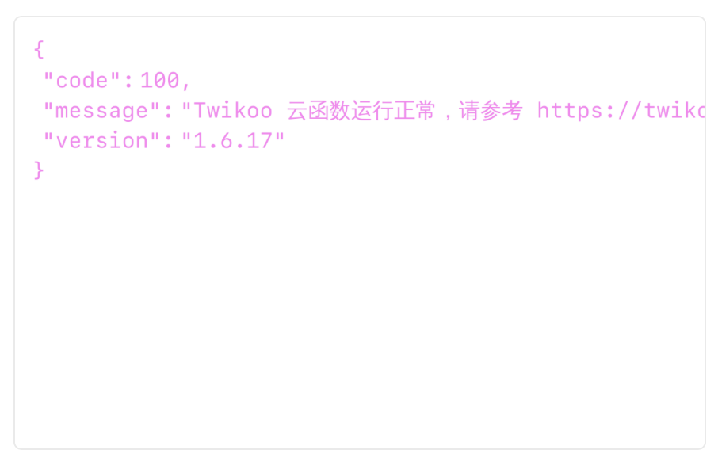
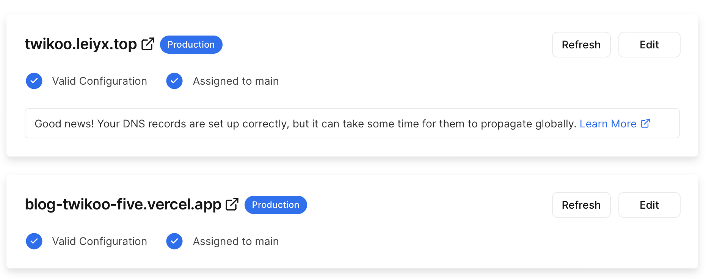
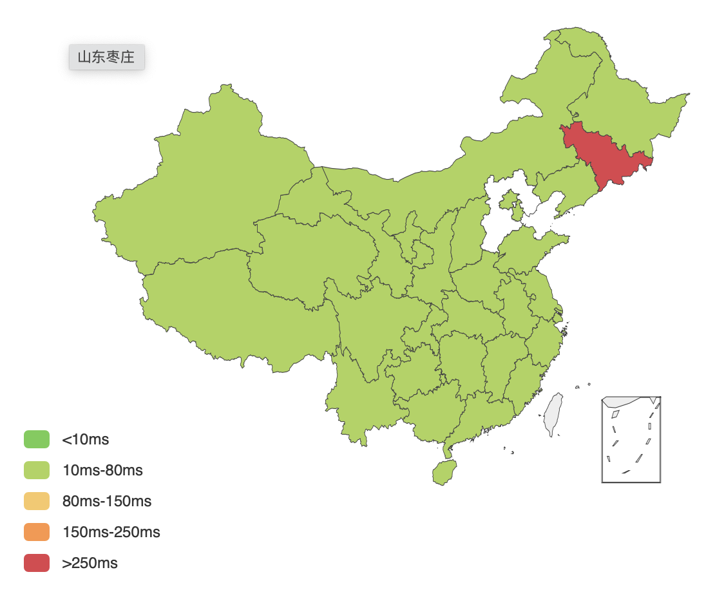
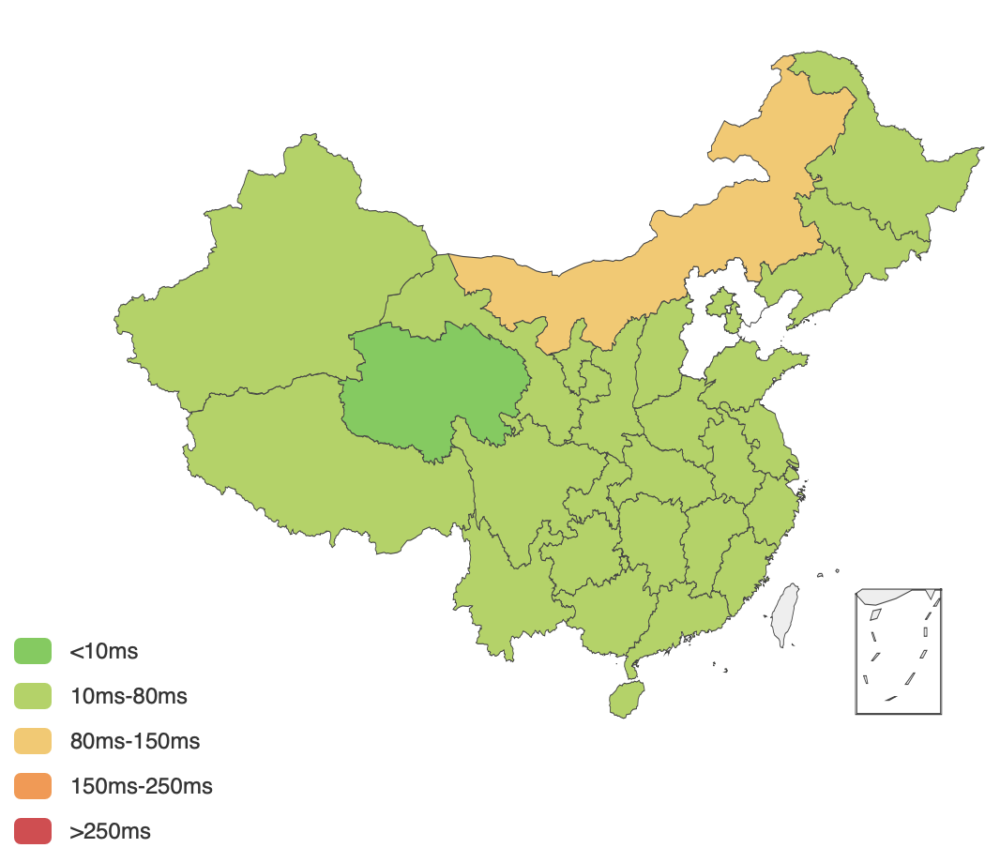

[Stack主题文档]( https://docs.stack.jimmycai.com/)

## 扩展语法





Lorem ipsum dolor sit amet, consectetur adipiscing elit, sed do eiusmod tempor incididunt ut labore et dolore magna aliqua. Ut enim ad minim veniam, quis nostrud exercitation ullamco laboris nisi ut aliquip ex ea commodo consequat. Duis aute irure dolor in reprehenderit in voluptate velit esse cillum dolore eu fugiat nulla pariatur. Excepteur sint occaecat cupidatat non proident, sunt in culpa qui officia deserunt mollit anim id est laborum.



### gallery

gallery用法示例：

 


## 资源


获取网站icon的方法：

1. 直接在网址后面加/favicon.ico
2. 检查网页源代码，一般在header标签里面
3. 利用icon下载网站，比如favicon grabber、The Favicon Finder

[文章配图网站](https://zhuanlan.zhihu.com/p/453179239)

矢量图标库：https://www.iconfont.cn

## Markdown测试

```cpp
int main() {
    int x = 10;
    x += 4;
    return 0;
}
```
$\epsilon = 1$
$$
\Delta = a + b + c
$$


***

1. 有序列表1
   1. 有序列表1.1
2. 有序列表2

- 无序列表
  - 无序列表
- 无序列表

> quote

`inline code`

english words、中文

链接示例:[this is a ref](https://github.com/xiaosage1999/my_hugo_stack)、[this is a ref](leiyx.top)

**bold**,对的，这是粗体。只要不在中间打一个空行，就认为这是一个段落

完整图片示例：
 


## 改进


我的twikoo采用云函数部署方式，部署在vercel上。deploy后显示如下内容表示twikoo部署成功。



但是我发现博客中的twikoo评论在不科学上网时，加载速度极其缓慢。此时博客仓库中配置项为：

```toml
[comments.twikoo]
envId = "blog-twikoo-five.vercel.app"
region = "AWS / N. Virginia (us-east-1)"
path = ""
lang = "zh-cn"
```

在vercel项目中添加自己的域名



重新设置envid后。再访问博客，twikoo评论加载速度就很快了。

```toml
[comments.twikoo]
envId = "https://twikoo.leiyx.top"
region = "AWS / N. Virginia (us-east-1)"
path = ""
lang = "zh-cn"
```

在不科学上网的情况下，两个域名的DNS查询对比：

blog-twikoo-five.vercel.app：



https://twikoo.leiyx.top：

